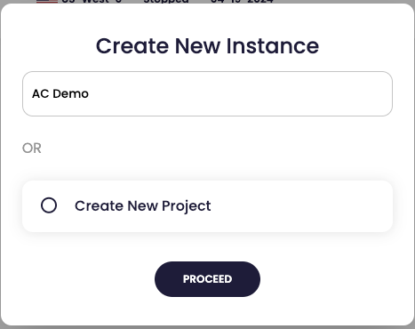

# American Cloud Compute Tutorial

This tutorial covers all of the basic commands and processes for creating a Python application on [American Cloud](https://americancloud.com).

__Main Support Page__:

https://marc-w.com/american-cloud-python/

__Watch the video__: 

https://youtu.be/zUOy5it5iFY

__Fork the repository__:

https://github.com/marc-w/ac_python

## Let's GO!

## Create American Cloud Account

Set up an account and connect a funding source.

https://americancloud.com

## Set Up AC Compute Instance

Via the website `Projects` > `Create Project` https://app.americancloud.com/project/create


Next, create a new instance, `Cloud Compute` > `+ CREATE NEW INSTANCE` > [dialog box] select a project.



Start with minimal provisioning:

* Create Instance with Public IP: Yes
* Location: US-West-0 (little preference)
* Network: Elastic Cloud
* Server Type: Standard
* Server Image: Linux Server > Ubuntu
	* 22.04 Noble LTS
		* __Generally, I prefer the newest LTS image__
* Server Size `#tiny`
	* Core: 1vCORE
	* Memory: 1GB
	* Storage: 25GB
	
Note: _No need for startup script or ssh key options. Use these with caution._
	
Hit `Review and Deploy,` and complete any additional confirmation dialog boxes.

In moments the instance will be available.

## Instance Created

The created instance dashboard:


### Shell into the instance

In your terminal of choice:

`ssh cloud@{IP address}`

The IP address field in the dashboard should be valid IPV4.


Provide the default password, also available in the dashboard.

Choose to accept the SSH fingerprint.


You are now logged in; the terminal prompt will change to represent the instance, such as:

```
cloud@vm-acdemo-f610cb:~$ 
```

The user name and home folder are `cloud.`

### Enable Upgrades

The instance will, by default, restrict the ability to upgrade.  This must be addressed first.  Edit the following configuration file with this command:

```
sudo vim  /etc/update-manager/release-upgrades
```

This will place you in a VIM editor instance.  If you are unfamiliar with VIM, the internet is your friend.

Change the value for `Prompt` to `normal` where the default was `lts`.


## Important Note

A lot of pathing is for an application is assumed to be named `ac_python`; change the file path at your peril.
 
### Perform Upgrade

It is best practice to upgrade at this point; use the following command:

```
sudo apt-get update
```

The upgrade process concludes in minutes. Once complete the last line reads:

```
Reading package lists... Done
```

## Connecting GitHub

In this section, you configure GitHub access using a read-only deploy key to fetch code. This step is a one-time effort.

### Create a deploy key in GitHub

First, generate a valid key on the instance, issue the command:

```
ssh-keygen -b 4096 -t rsa 
```

For the filename, press enter to use the default `/home/cloud/.ssh/id_rsa`

Optional, choose a passphrase or press enter for none.

When complete, the output will look like the following:


### Add the key to GitHub

In the GitHub repository (fork) choose the `Settings` tab > `Deploy keys` > `Add deploy key` (button)

__In the next screen:__

1. Provide a title for the key

2. Add the key, instructions follow for copying the key out of the instance.

While logged into the instance you need to view the __public__ key. Assumption: You are using the default name `id_rsa` :

```
cat /home/cloud/.ssh/id_rsa.pub
```


Copy the public key, all of it:


Paste the clipboard data into the `key` field in GitHub:


Do not select `write` access; the instance only needs to read the repository.

Add the key; you may need to authenticate.

Once saved, the key should is listed as a deploy key:


## First Repository Clone

Next you will hydrate the instance for the first time. In the home directory (`cd ~` aka`/home/cloud/`), issue this command:

Note: _Your git URL will differ from mine, edit the next command as needed._

```
git clone git@github.com:YOUR_HANDLE_ON_GITHUB/ac_python.git
```

Accept `yes` to the SSH key when asked.

Code is now available in the root folder `/home/cloud/ac_python`.

## More Set Up

Before the code can be tested a few things need to happen:

* The app needs a web-hook for Slack
* The web-hook address is a secure asset (should be protected) and is made accessible using local environment variables
* Install Python package management, virtual environment, and fetch requirements.

### Slack Web-hook

You will need a Slack web-hook address. If you need help, go <a href="slack_webhook.md">here</a>.

### Add the web-hook to the instance

Adding the web-hook to the instance is a one-time task.

In the instance add a key:value pair to the `environment` file. Issue this command to edit the file via VIM:

```
sudo vim /etc/environment
```

Configuration format:

```
key="value"
```

Add the key `slack_webhook` to your `environment` file at on the bottom. 

```
slack_webhook="https://YOUR_SLACK_WEB_HOOK"
```


Save the `environment` file and exit VIM.

The web-hook information will not be available until the server is rebooted. 

**Now is the time** to reboot the instance from the dashboard and log back in.

In the instance, issue `printenv` to verify that `slack_webhook` is available.


## Python Dependencies and VENV

As a Python app, we require Python's PIP capabilities to install packages (dependencies). 

There is a risk of breaking the Debian (Linux) system using PIP to install new Python files without a virtual environment.  The concern is altering OS-level Python usage. Using a Python virtual environment (VENV), we add minimal overhead and enjoy a stable runtime.

First, you need to install PIP for package management:

```
sudo apt install python3-pip
```

Select `Y` to install when the prompt asks.

Next, you need to add a virtual environment.

Note: expect this command to differ based on your current Python version.  This tutorial used 3.12.

```
sudo apt install python3.12-venv
```

Select `Y`es when prompted.

Change directory to inside the `ac_python` folder (`cd ~/ac_python`) and issue this command to create a virtual environment.

```
cd ~/ac_python
python3 -m venv .venv
```

Manually activate the VENV in the ac_python directory.

```
source .venv/bin/activate
```

The terminal prompt should change, note `(.venv)` is appended to the  left.


Now you can install the requirements for the Python application:

```
pip install -r requirements.txt 
```

## Test the application

Now we test. Run this command inside the `ac_python` folder (`cd ac_python`):

```
python3 main.py
```

Expect some output to the terminal:


Slack will receive the web hook from the instance application and produce a message similar to:


Stop the test via `control` + `c`. (Exact command may vary based on the operating system)

## Start Automatically on System (re)Boot

Next, you make the application automatically start and run whenever the instance boots.

Your instance will use the `crontab` deamon to start the service via the `reboot` call. Edit or create a crontab file using the following command:

```
crontab -e
```

Note: _Use of full, absolute path is generally best practice in bash scripting. Syntax matters._

You may need to select your editor; I choose vim basic, option `2`:

```
$ crontab -e
no crontab for cloud - using an empty one

Select an editor.  To change later, run 'select-editor'.
  1. /bin/nano        <---- easiest
  2. /usr/bin/vim.basic
  3. /usr/bin/vim.tiny
  4. /bin/ed

Choose 1-4 [1]: 
```

Add the following lines to the bottom of the crontab file. 

```
# Force permission on startup, repository may not be executable
@reboot chmod +x /home/cloud/ac_python/startup.sh
# Runs the startup script, including virtual environment and python file
@reboot /bin/bash -c "/home/cloud/ac_python/startup.sh" & 
```

Finally, manually set the permission for the startup file, because we can and it feels right.

```
sudo chmod +x /home/cloud/ac_python/startup.sh
```

Restart the instance, log back in (optional, everything should be working now)

The instance should come back online; you are done! 

A default message and current timestamp should be delivered to Slack as long at the instance is running.

# Deployment

Feel free to use the included minimal deploy script.  The file pulls pulling current code from GitHub.  You need to `cd` into the project folder `ac_python` and run the deploy script:

```
. ./depoloy.sh
```

How the deploy script works:

1. The local (on instance) git repo is reset using `--hard`. This is because changing the `startup.sh` to executable creates a local git differential.  Blunt times require blunt solutions.
1. Next, `git pull` is called
1. Server is rebooted

Other options exist.

Celebrate.  I know I did.

## Thanks

I hope you enjoyed it. Feedback welcome.

https://marc-w.com

#INGWEFM

