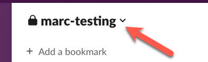
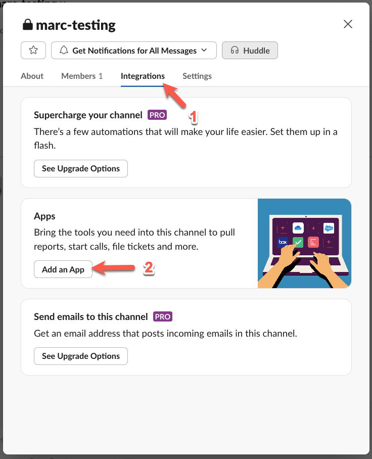
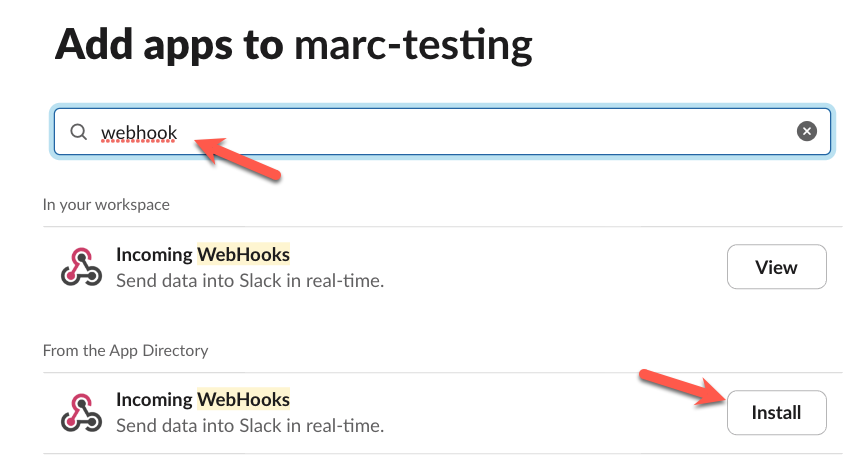
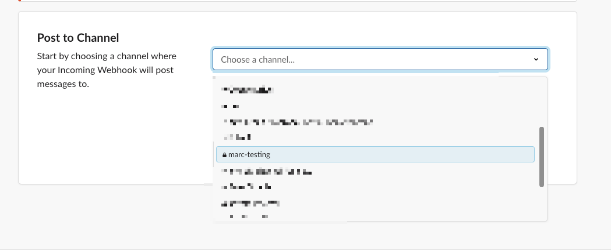
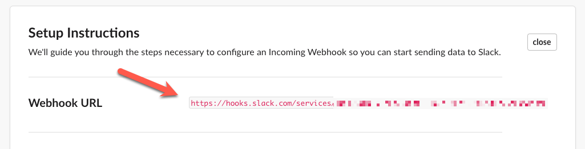

## Creation of a Slack Web-hook

The creation of a Slack webhook is a one-time task for this tutorial. Calling the Slack webhook can be substituted with any other combination of tasks to fire off.  

Since Slack is free and ubiquitous, I used this service (via a webhook) to have the application reach out and do something.  

You will need a free Slack workspace with access to create web-hook permissions. 

The thing" we are "doing" is running an infinite loop in Python (`while True:`) to send a date-time to a selected Slack channel at a short interval with a default of 15 seconds.

The following steps are from July 2024.  If you need help, [Slack is well documented](https://api.slack.com/).

If necessary, create a channel in Slack, become a member of that channel, and use the channel settings to create a web-hook.

Note: _The demo is noisy; nobody likes a noisy bot in a company Slack channel._

From the channel, select the channel dropdown:



Then select the "Integrations" tab and finally the `Add an App` button.



Search for `webhook` and select `Install`; a webpage will open for the next configuration.



On the webpage, select or search for the target channel and add the integration.



The following page will provide a `https` address for the incoming web-hook. Copy that link and save it locally and securely.



The format for the web-hook is:

```
https://hooks.slack.com/services/XOXOXOXOX/XOXOXOXOXO/XOXOXOXOXOXO
```
Now, you can add the web-hook to the instance environment variables.